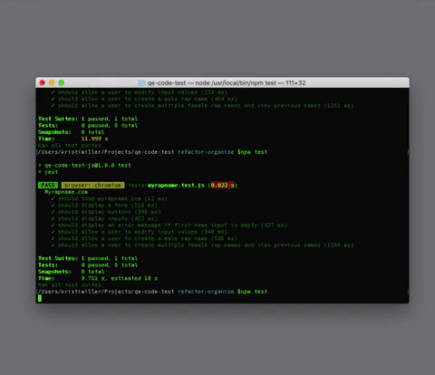

 

  
  <h1 align="center" style="padding:0px; margin:10px 0px">Quality Engineer Code Challenge</h1>
  <h5 align="center" style="margin:0px 0px 20px 0px; padding:0px;">Executed by Kristi Miller</h5>
  

    This is a code challenge for an open Quality Engineer in Test position. The company wants to create several new tests on various components outlined in the specifications detailed below.
     
  

## About The Project

### Testing Tools Used
* PlaywrightJS
* Jest

### Running Tests
This project uses NodeJS( Node 12+ ) and NPM.

Run `npm install` to install dependencies.

To run the tests, run `npm test` and the they will begin to run in a "headfull" Chromium browser.

### Specifications
Write an automated test to validate each of the following:
- The input fields exist.
- A negative scenario using the input fields.
- Input data into the fields.
- Submit a name for male with a nickname and validate that a new name has been prepended to the list.
- Submit twice for a female with a last initial and validate that a new name has been prepended to the list.

## About The Process

### My Process
1. READING / RESEARCH : I began by researching the technologies I was not familiar with. In this case it was PlaywrightJS. I looked over the documentation and focused on how to select elements and assert their presence.

2. PLANNING / SETUP : I determined a scheduled plan to complete the given tests in a timely manner. I used GitHub Projects, Issues, and Milestones together to create a solid plan. This plan began with the initial repo setup and installation of dependencies.

3. TESTING : I executed each test one at a time. I utilized the PlaywrightJS docs as a reference.

4. DOCUMENTATION : I refactored tests that seemed to give a false positive result, organized the codebase, and updated the documentation in the testing and readme files.

## Wins

- Many of the elements were very difficult to target because the html was not specific and had no css selectors. I was able to target all of the elements I needed by traversing through parent elements and working my way down.

- During my refactor I noticed that some of the tests may have been giving me a false positive. After evaluating I realized that I was using a `.click` action inside of the expect statement when I should have been using `.isVisible`. I was able to fix these issues and learned a lot in the process.

## Challenges

- The html was very difficult and frustrating to navigate, especially while using a framework I was new to.

- The documentation for PlaywrightJS was often vague and difficult to understand for this project's specific use. Most of the documentation dealt with using css selectors to select elements, which were absent in the html for this project.

## Contact Kristi
* [Github](https://github.com/Kristiannmiller)
* [Portfolio](http://www.kristiannmiller.com)
* [LinkedIn](https://www.linkedin.com/in/kristiannmiller/)

## Additional Links
- [Repository](https://github.com/Kristiannmiller/qe-code-test)
- [Project Board](https://github.com/Kristiannmiller/qe-code-test/projects/1)
